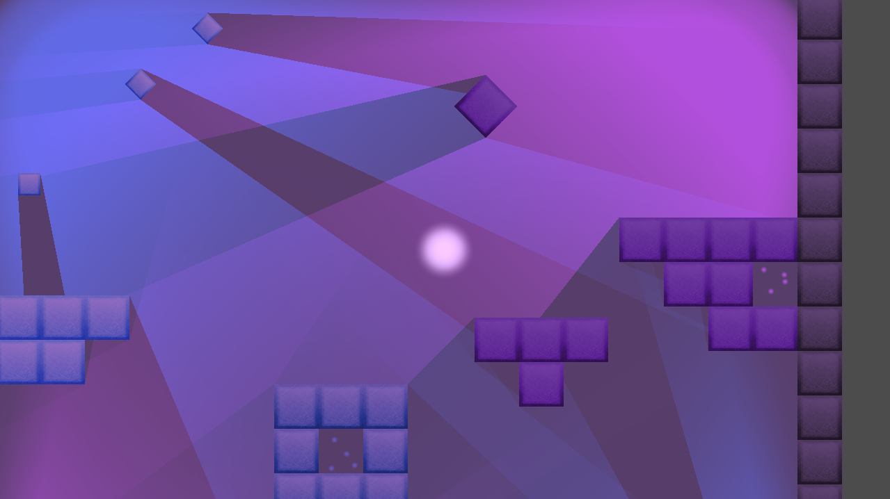
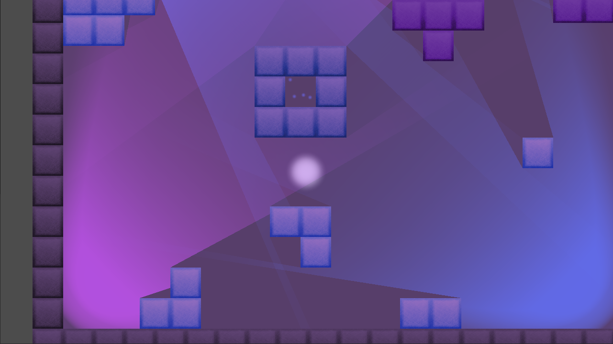

# The Freshman Fifteen
Well, I'm fifteen days in and happy to report that I'm 15/15; I haven't missed
a day, yet. The heading is kind a misnomer for how these days have gone. I'm
an experienced developer that's worked in similar environments in past and so
there have yet to be any technical challenges that were difficult to solve (and,
as far as I can tell, there's been no weight gain). That's not to say these first
fifteen days haven't presented any challenges. So where did I have trouble?

## Challenges
- **Confidence**  
The most challenging part of these fifteen days was keeping myself 
inspired. There were a few days where I thought to myself "This is all I've 
produced so far? What a joke." I think most of those were mini, caffeine-induced
anxiety attacks. Thankfully I was able to power through those days, and, when I
look back at what I've produced after 15 days, I'm not totally embarrassed. To
help in times like this, I have a Google Doc that I've generated over the years
that are filled with motivational quotes to keep me going. The one I kept 
pointing towards during these first fifteen days was one by Henry Ford:

*If you think you can do a thing or think you can't do a thing, you're right. - Henry Ford*

I'm doing my best to stay on the "think I can" side of that quote. I've been 
succeeding for the most part.

- **Sacrifices**  
One hour per day doesn't sound like much. However, throw in the occasional twelve
hour work day, dinner, bedtime routine for my son, and it can be 10pm (past my 
regularly scheduled bedtime!) before I have an opportunity to work on anything
personal. I can manage that well enough, but its my family, specifically my wife
that is making the sacrifice of seeing me less. Although, I have a suspicion that
she may not mind too much on certain days. Still, trying to play life with one 
less hour per day, minimum, has presented challenges. Nothing a cup of coffee 
hasn't fixed yet.

- **I Suck at Art**  
This is no surprise to me. I've never been a skilled artist, digitally or 
otherwise. Graphic design is a major part of game development and it's been 
difficult for me to even create demonstrations that doesn't look like total garbage.
Thankfully, I've found enough free graphics online to keep me afloat. That
being said, don't expect a graphical masterpiece. I hope to leverage my technical
strengths to implement features that are engaging enough that players will overlook
the lackluster graphics. Maybe my next 100DaysOfX should focus on pixel art...

## Progress So Far
Hey, you're probably here to see what I've built! Let's take a look...

Since the start I was pretty sure that I wanted to make heavy use of
lighting in my game and that's where a large portion of my focus has been spent. I had
a difficult time finding decent 2D light textures online, but I spent a couple
days messing around with IES files to generate my own lights. I'm pretty happy
with the results.

So far Godot has been incredibly intuitive to use and provides all of the 
capabilities I would expect from a commercial 2D game engine, despite being 
totally free. I've been able to implement all of my concepts rapidly. GDScript 
is well documented and is extremely similar to Python, which happens to be my 
favorite language currently. I'm looking forward to fleshing out further game 
design concepts in Godot.

Sometimes it's clear that I'm still new to the engine. One wrong mouse click can
send your entire game crashing down on you...

## Do I Know Where I'm Heading?
I'm beginning to hone in on some concepts for an actual game. I'm 
thinking it will be a puzzle/action game, specifically one that messes with the 
player a la Portal and Antichamber. Currently I'm considering an environment 
that constantly shifts around the player. Here's a proof of concept of some 
shifting graphics:

That's just a proof of concept, but I can imagine entire rooms whose layout will
shift based on some user action (or maybe something nefarious!). Mixing that 
with some of the lighting features I have in mind could result in some 
unbelievably complex puzzles.

I probably won't blog again until Day 30. My initial goal by day 30 was to have
a good understanding of GodotEngine, an initial concept proofed out for a game,
and a path to produce an alpha or beta version by day 60. The game concept is 
getting there, and I've already learned a lot about Godot. Right now I'd say that
I'm on track to meet my day 30 goal. Fingers crossed!
